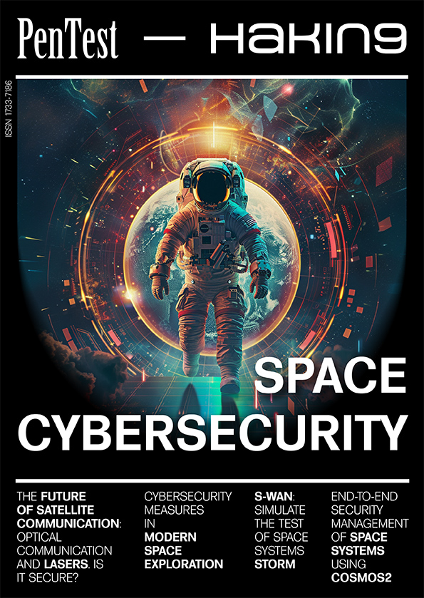
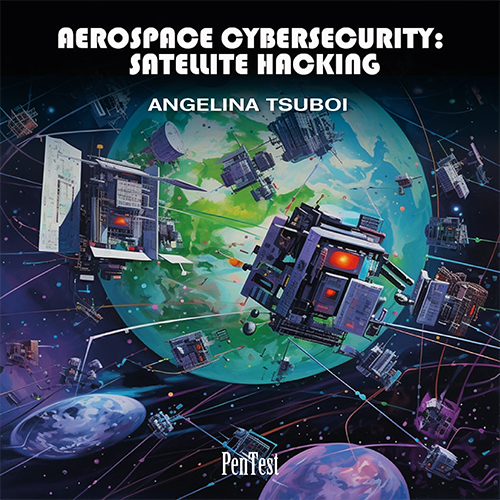

# Space Cybersecurity

Welcome to the repository for the eBook "[Space Cybersecurity](https://pentestmag.com/product/space-cybersecurity/)!" This repository contains the code snippets and external code references used throughout the book. Whether you're a beginner or an experienced cybersecurity professional, this resource is designed to enhance your understanding and practical skills in space cybersecurity.

## Contents 📚

- **ExternalCode**:
  - **Nanosat MO Framework**: Contains code from the [ESA's Nanosat MO Framework](https://github.com/esa/nanosat-mo-framework) repository.
  - **Open MCT Tutorial**: Contains code from the [NASA's Open MCT Tutorial](https://github.com/nasa/openmct-tutorial/tree/part-b-step-1/example-server) repository.

## Licensing 📜

### Nanosat MO Framework
[ESA's Nanosat MO Framework](https://github.com/esa/nanosat-mo-framework) is licensed under the [Apache License 2.0](https://opensource.org/licenses/Apache-2.0).

### Open MCT Tutorial
[NASA's Open MCT Tutorial](https://github.com/nasa/openmct-tutorial/tree/part-b-step-1/example-server) is licensed under the [Apache License 2.0](https://opensource.org/licenses/Apache-2.0).

## Deepen Your Knowledge 📖

To further enhance your skills and knowledge in space cybersecurity, consider enrolling in the course "[Aerospace Cybersecurity: Satellite Hacking](https://pentestmag.com/course/aerospace-cybersecurity-satellite-hacking-w53/)" offered by Pentest Magazine. This course provides in-depth training on combining cybersecurity techniques with space technology.

## Follow the Projects 👥

Support the projects and repositories referenced in the eBook:
- **[ESA's Nanosat MO Framework](https://github.com/esa/nanosat-mo-framework)**: Follow the European Space Agency's project for more updates and contributions.
- **[NASA's Open MCT Tutorial](https://github.com/nasa/openmct-tutorial/tree/part-b-step-1/example-server)**: Follow NASA's project for more insights and development in space technology.

🎉 Follow these projects for more interesting updates and contributions! 🎉

## Contributing 🤝

We welcome contributions from the community to improve the code and documentation in this repository. Feel free to submit pull requests or open issues if you have suggestions or encounter any problems.

## Disclaimer ⚠️

The code provided in this repository is for educational purposes only. Use it responsibly and only in environments where you have explicit permission to do so.

## Contact 📬

Pentesting holds no secrets for you? Do you have a project you'd like to showcase, or are you interested in collaborating as a course creator for our site? Get in touch with us! We're sure to find something exciting for you. Reach out at [Pentest Magazine](https://pentestmag.com/contact/).

Happy Pentesting! 🛡️
